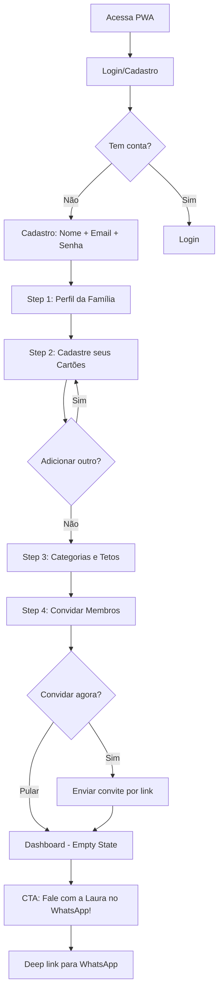
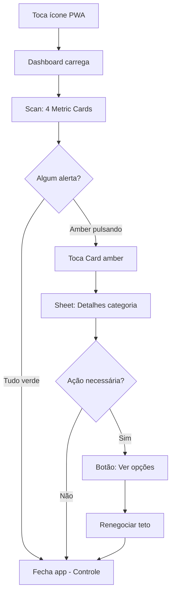
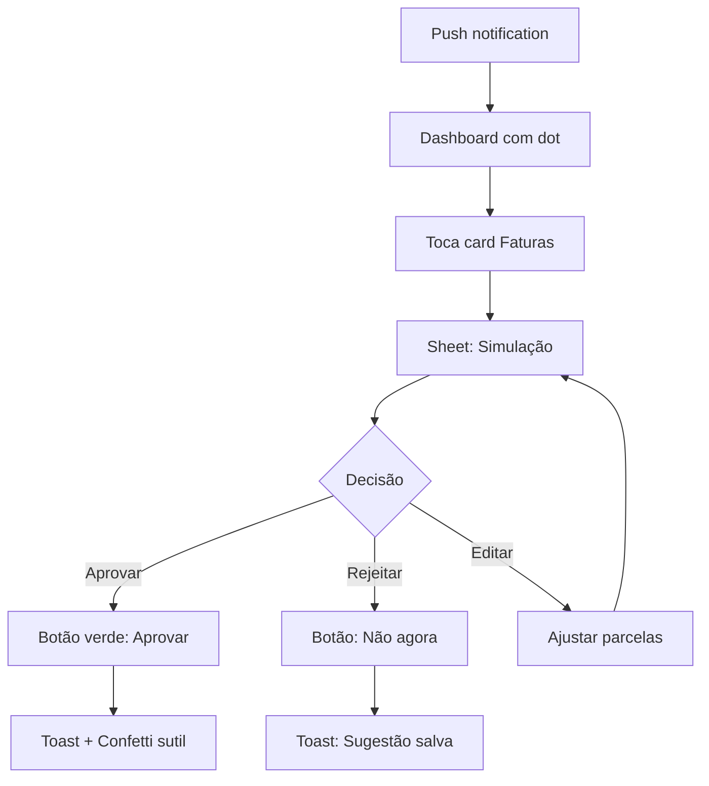
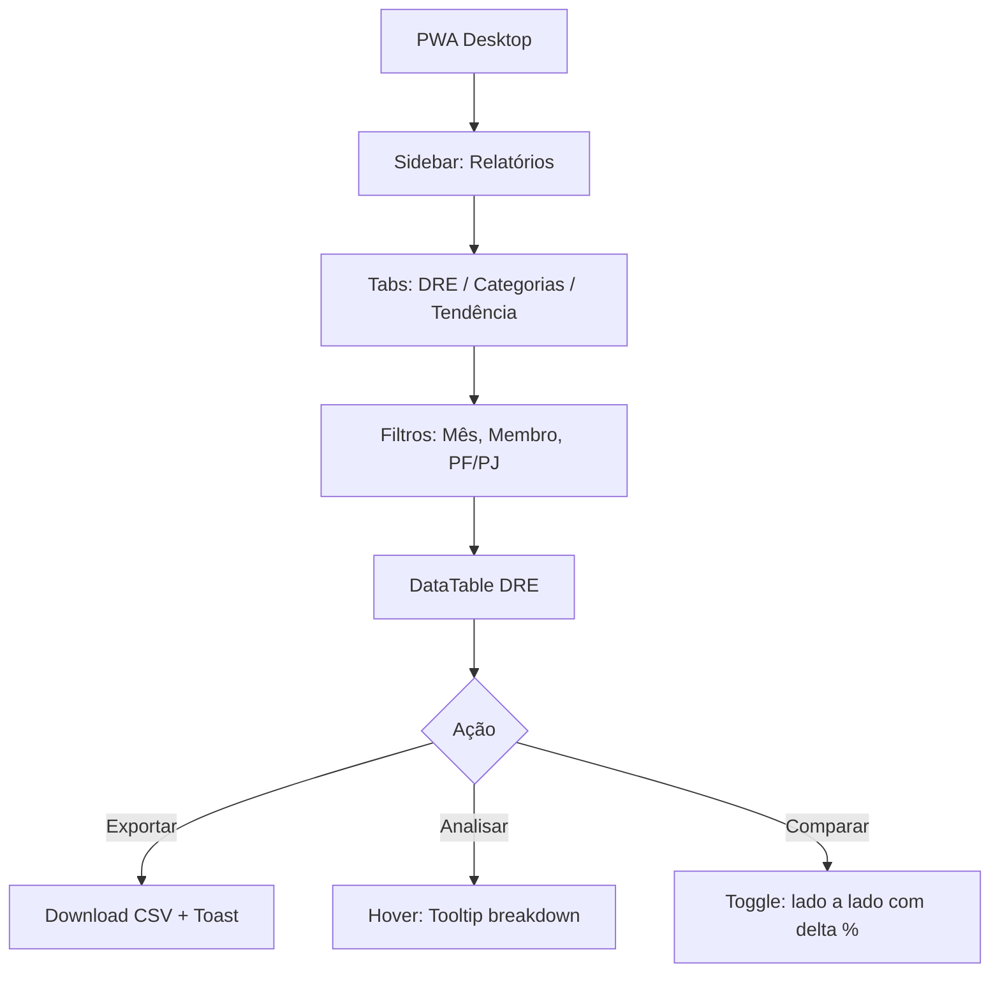
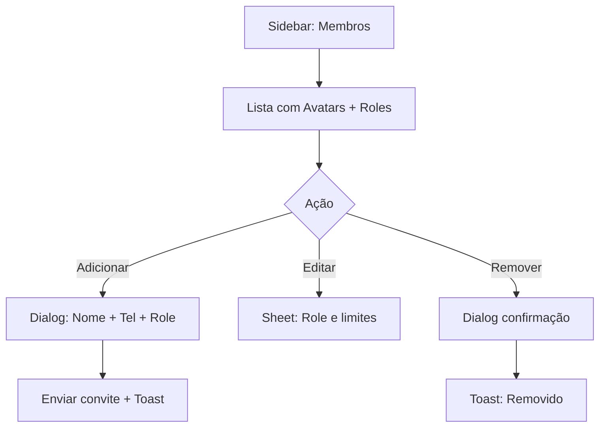
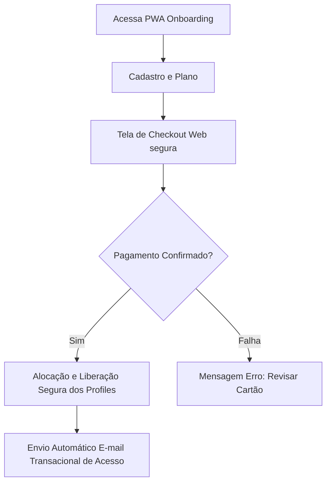

# UX Design Specification Laura Finance (Vibe Coding)

**Author:** Nexus AI
**Date:** 2026-03-10

---

## Executive Summary

### Project Vision

A Laura Finance é um ecossistema financeiro dual onde a captura de dados acontece via conversação natural no WhatsApp (IA "Laura") e a gestão profunda opera num PWA Mobile-First. O design UX deve refletir esta dualidade: o PWA é o "cérebro visível" — sofisticado, analítico e poderoso — mas nunca complexo a ponto de substituir a simplicidade do chat.

O design system será baseado em **shadcn/ui** com dark mode como experiência padrão, inspirado nas tendências de apps financeiros premium de 2025-2026: Cards modulares, gráficos dinâmicos animados (Recharts), navegação task-based e UX emocionalmente suportiva com micro-feedbacks de gamificação.

### Target Users

| Persona | Papel | Dispositivo | Frequência PWA | Complexidade |
|---|---|---|---|---|
| Mariana (34) | Proprietária/Mãe | Mobile | Semanal | Média |
| Carlos (29) | Prosumer/MEI | Mobile | Quinzenal | Alta (PF/PJ) |
| Thiago (35) | Cônjuge/Admin | Mobile | Sob demanda | Baixa-Média |
| Joana (42) | Mentora/Proprietária | Desktop + Mobile | Mensal | Alta (DRE/IR) |

### Key Design Challenges

1. **Dualidade WhatsApp ↔ PWA:** O PWA complementa o chat; nunca compete com ele. Onboarding guiado por Wizard. Dashboard esporádico porém rico.
2. **Onboarding Denso:** Cadastro de cartões, categorias e membros requer wizard step-by-step com shadcn Stepper + Progress + Cards.
3. **Prosumer Split Visual (PF/PJ):** Sistema de Tags visuais com cores distintas operando sobre Cards e Tables unificados.
4. **Responsive Dual:** Mobile-First para Mariana/Thiago (dashboard compacto), Desktop-Enhanced para Joana (tabelas DRE expandidas).

### Design Opportunities

1. **Dark Mode Premium (Default):** Paleta violeta (#7C3AED) + verde-money (#10B981) + deep-slate (#1E1E2E). shadcn dark mode nativo via CSS variables.
2. **Dashboard Vivo:** Charts animados (Area/Bar/Pie via Recharts), countUp nos saldos, progress bars dos tetos com transições suaves.
3. **Gamificação Sutil:** Badges, Streaks e Health Score financeiro com gauge circular animado.
4. **Chat Preview Sidebar:** Mini-timeline da conversa com a Laura no PWA, ponte visual entre os dois mundos.

## Core User Experience

### Defining Experience

O core loop da Laura Finance no PWA é: Abrir → Ver saldos/alertas → Agir (se necessário) → Fechar. O Dashboard é "consumido" em momentos curtos e esporádicos — nunca como sessão de trabalho longa. A exceção é Joana (Desktop), que realiza análises profundas mensais.

A ação crítica a acertar é o **onboarding**: sem ele, o WhatsApp não funciona. O wizard step-by-step deve guiar o Proprietário em menos de 5 minutos pelo setup completo (Cartões → Categorias → Membros → Tetos).

### Platform Strategy

- **PWA Mobile-First:** Next.js + shadcn/ui. Interface otimizada para touch com Cards empilhados, bottom sheet navigation e gráficos compactos.
- **PWA Desktop-Enhanced:** Mesma codebase responsiva. Tabelas expandidas, sidebar de navegação, relatórios multi-coluna.
- **PWA Install:** Manifesto para atalho na home screen. Simula app nativo sem dependência de App Stores.
- **Sincronização Real-Time:** WebSocket/Webhooks conectando ações do WhatsApp ao Dashboard instantaneamente.

### Effortless Interactions

- Saldo restante por categoria → Cards com Progress Bar animada
- Identificação de quem gastou → Avatar + Badge colorido por membro
- Aprovação de simulação → Bottom Sheet com botão único "Aprovar"
- Export DRE → Botão "Exportar CSV" no topo
- Alternância PF/PJ → Toggle Switch no header
- Novo cartão → Dialog modal com 3 campos

### Critical Success Moments

1. **Aha Moment:** Primeiro gasto do WhatsApp aparece no Dashboard automaticamente.
2. **Control Moment:** Progress Bar de categoria pulsando em amber ao atingir 80% do teto.
3. **Rescue Moment:** Sheet de simulação de rolagem com 1 botão de aprovação.
4. **Power Moment:** Relatório DRE profissional exportável em 1 clique.

### Experience Principles

1. **"Dashboard ≠ Obrigação"** — O PWA é prazer, não tarefa. Curiosidade, não burocracia.
2. **"3 Segundos ou Menos"** — Informação crítica visível sem cliques adicionais.
3. **"Cada Pixel Transmite Confiança"** — Dark mode premium com shadcn/ui. Tipografia Inter. Micro-animações.
4. **"WhatsApp e PWA São o Mesmo Cérebro"** — Sincronização instantânea entre chat e Dashboard.
5. **"Composable, Não Monolítico"** — Blocos shadcn independentes recombináveis por contexto de persona.

## Desired Emotional Response

### Primary Emotional Goals

1. **🛡️ Segurança e Controle** — "Eu sei exatamente onde está o meu dinheiro." Dashboard visível, organizado e sob controle.
2. **✨ Alívio e Leveza** — "Não preciso me preocupar com isso." A carga mental transferida para a Laura.
3. **🏆 Orgulho Discreto** — "Estou mandando bem." Micro-doses de orgulho quando tetos são respeitados e o Health Score sobe.

### Emotional Journey Mapping

| Momento | Emoção Desejada | Tradução UX |
|---|---|---|
| Primeiro acesso (Onboarding) | Curiosidade + Confiança | Wizard limpo, progress visual, estética premium dark mode |
| Primeiro gasto via WhatsApp aparece | Surpresa + Satisfação | Toast/animação sutil. "It works!" moment |
| Consulta rotineira do Dashboard | Calma + Controle | Cores neutras, verde em saldos saudáveis, sem excesso |
| Alerta de 80% do teto | Atenção Cuidadosa (NÃO pânico) | Amber suave com pulse, tom amigável |
| Alerta de teto estourado | Responsabilidade sem Culpa | Vermelho discreto, mensagem construtiva |
| Simulação de rolagem aprovada | Alívio Profundo | Confetti sutil + mensagem positiva |
| Health Score subindo | Orgulho + Pertencimento | Badge animado + countUp |
| Exportação de DRE | Profissionalismo + Competência | Feedback limpo, sem fanfarra |
| Erro de IA | Transparência, NÃO frustração | Tom humano e carinhoso |
| Retorno após dias | Re-engajamento | "Bem-vinda de volta! A Laura registrou 12 gastos." |

### Micro-Emotions

| Espectro | Estado Desejado ✅ | Estado a Evitar ❌ |
|---|---|---|
| Confiança ↔ Confusão | Confiança inabalável | Confusão sobre onde clicar |
| Controle ↔ Ansiedade | Controle suave | Ansiedade por excesso de dados |
| Orgulho ↔ Culpa | Orgulho discreto | Culpa por gastos (jamais!) |
| Surpresa ↔ Monotonia | Micro-surpresas positivas | Interface monótona |
| Pertencimento ↔ Isolamento | "Minha família financeira" | Sensação de app solitário |

### Design Implications

- **Segurança** → Cards com bordas sutis, ícones de cadeado, saldos mascarados por padrão com eye-toggle
- **Alívio** → Animações suaves (300ms ease). Bottom sheets em vez de modais agressivos
- **Orgulho** → Badge system (shadcn Badge). Green glow em metrics saudáveis. Streak counter
- **Calma** → Paleta deep-slate (#1E1E2E) dominante. Tipografia Inter 16px. Line-height 1.6
- **Atenção** → Amber (#F59E0B) para warnings. Vermelho APENAS para saldo negativo
- **Transparência** → Mensagens de erro em tom conversacional, jamais códigos ou jargão

### Emotional Design Principles

1. **"Elogie Sempre, Brigue Nunca"** — Reforço positivo em conquistas. Tons neutros e caminhos construtivos nos estouros.
2. **"Amber Antes do Vermelho"** — Alerta com calma ANTES do problema. Vermelho só quando o fato já ocorreu.
3. **"Cada Animação Tem Propósito"** — Micro-animações comunicam (progress pulsando = atenção, confetti = sucesso). Nunca decorativas.
4. **"Humanize o Erro"** — Falhas geram mensagens em português coloquial e carinhoso.
5. **"Dark = Confiança"** — Dark mode como declaração emocional de seriedade e sigilo financeiro.

## UX Pattern Analysis & Inspiration

### Inspiring Products Analysis

**1. Nubank (Fintech BR)**
- Onboarding brutalmente simples. Dashboard com saldo proeminente. Gráfico de gastos por categoria com barras horizontais coloridas. Histórico de transações como feed infinito.
- Pull-to-refresh com animação. Sheet bottom-up para detalhes de fatura.
- **Padrão reutilável:** Saldo grande + barras de categoria + feed de transações como Cards.

**2. YNAB (You Need A Budget)**
- "Assign Every Dollar" traduz-se nos tetos da Laura. Progress bars por categoria com transição de cores (verde → amber → vermelho). Overview mensal com desvio destacado.
- **Padrão reutilável:** Sistema de barras de orçamento com transição de cores para FR13 (alerta 80%).

**3. shadcn/ui Dashboard Example**
- Sidebar colapsável. Cards de métricas no topo. Charts composáveis com tooltips ricos. DataTable com sorting/filtering. Dark mode nativo.
- **Padrão reutilável DIRETO:** Layout inteiro (Sidebar + Header + Content + Cards grid).

**4. Cleo AI (Chatbot financeiro)**
- IA com personalidade (humor, emojis, tom casual). Dashboard mostra spending insights como cards empilhados. Transição fluida entre chat e dashboard.
- **Padrão reutilável:** Consistência de personalidade cross-plataforma (Laura PWA = Laura WhatsApp).

### Transferable UX Patterns

**Navigation:**
- Sidebar (shadcn) → Desktop: Dashboard, Transações, Cartões, Membros, Relatórios, Config
- Bottom Tab Bar → Mobile: Home, Transações, + (Quick Add), Relatórios, Config
- Sheet Bottom-Up (Nubank) → Detalhe de transação, simulação, aprovação rápida

**Interaction:**
- Pull-to-Refresh → Sincronizar com dados do WhatsApp
- Swipe-to-Action → Editar/deletar transação (FR11)
- Long-press Context Menu (shadcn) → Ações rápidas em Cards
- Stepper Wizard (shadcn) → Onboarding 4 passos

**Visual:**
- Saldo Hero (Nubank) → Número grande centralizado com countUp animation
- Category Progress Bars (YNAB) → Barra por categoria com gradient verde→amber→vermelho
- Metric Cards Grid (shadcn) → 4 cards: Saldo Geral, Gastos do Mês, Faturas Pendentes, Health Score
- Transaction Feed (Nubank) → Lista com avatars, valores e badges de categoria

### Anti-Patterns to Avoid

| Anti-Pattern | Alternativa Laura |
|---|---|
| Menu hambúrguer escondendo navegação | Sidebar fixa (Desktop) + Bottom Tab (Mobile) |
| Dashboard sobrecarregado de gráficos | 4 Cards + 1 Chart principal. "Mais" via tabs |
| Onboarding com 10+ passos | Wizard 4 steps com "pular" para não-essenciais |
| Modal pop-ups bloqueantes | Bottom Sheets não-bloqueantes |
| Números vermelhos enormes em gastos | Vermelho discreto apenas em saldo negativo |
| Tabelas densas no mobile | Cards empilhados mobile, Table apenas Desktop |

### Design Inspiration Strategy

**Adopt (Direto):**
- Layout shadcn Dashboard (Sidebar + Cards + Charts)
- Progress Bars com transição de cor (YNAB)
- Saldo Hero com countUp (Nubank)
- Bottom Sheet para detalhes (Nubank)

**Adapt (Modificar):**
- Chat Preview sidebar (Cleo AI) → "Ultimas ações da Laura" em mini-timeline
- Gamificação badges (YNAB) → Health Score gauge + Streak counter
- Category cards (Nubank) → Toggle PF/PJ com tags visuais

**Avoid:**
- Over-engineering visual do YNAB Desktop (muito denso para mobile-first)
- Humor excessivo do Cleo AI (Laura é carinhosa mas profissional)
- Scroll infinito (preferir paginação + filtros para Joana Desktop)

## Design System Foundation

### Design System Choice

**shadcn/ui + Radix UI + Tailwind CSS v4** — Design system composable, open-code, com dark mode nativo e Charts built-in via Recharts.

### Rationale for Selection

1. **Zero Vendor Lock-in:** Cada componente é copiado para o projeto. Sem dependência de maintainer externo.
2. **Dark Mode First-Class:** CSS variables nativas para dark mode. Paleta violeta/verde-money injetada via globals.css.
3. **Charts Built-In (Recharts):** Componente Chart encapsula Recharts com theming consistente (Area, Bar, Pie).
4. **Fit com Next.js:** Design system default da Vercel. Zero config para SSR e App Router.
5. **Composabilidade:** Dashboard monta Cards + Charts + Tables como blocos LEGO.

### Implementation Approach

**Stack:**
- Next.js 15+ (App Router)
- shadcn/ui (Components) + Radix UI (Accessibility) + Tailwind CSS v4 (Styling)
- Recharts (Charts via shadcn Chart)
- Framer Motion (Micro-animations)
- next-themes (Dark mode toggle)
- Inter (Google Font)

**Componentes shadcn utilizados:**

| Componente | Uso na Laura Finance |
|---|---|
| Card | Metric cards, category cards, transaction cards |
| Chart (Area/Bar/Pie) | Dashboard charts, relatórios visuais |
| Progress | Barras de teto orçamentário por categoria |
| Badge | Tags PF/PJ, status de transação, gamificação |
| Sheet | Bottom sheet mobile (detalhes, simulação) |
| Dialog | Quick add transação, novo cartão |
| DataTable | Transações (Desktop), DRE (Desktop) |
| Sidebar | Navegação principal Desktop |
| Tabs | Alternância entre visões (Mensal/Semanal, PF/PJ) |
| Avatar | Identificação de membros da família |
| Switch | Toggle PF/PJ, configurações |
| Toast | Feedback de ações |
| Tooltip | Detalhes on-hover em gráficos |
| ContextMenu | Ações rápidas (editar/deletar transação) |
| Skeleton | Loading states |

### Customization Strategy

**Design Tokens (Dark Theme):**

```css
:root {
  --background: 240 10% 3.9%;        /* #0A0A0F deep-slate */
  --foreground: 0 0% 98%;             /* #FAFAFA texto principal */
  --card: 240 10% 6%;                 /* #0F0F17 card surface */
  --primary: 263 70% 50%;             /* #7C3AED violeta Laura */
  --secondary: 160 84% 39%;           /* #10B981 verde-money */
  --accent: 240 10% 12%;              /* #1E1E2E hover/active */
  --destructive: 0 72% 51%;           /* #EF4444 saldo negativo */
  --warning: 38 92% 50%;              /* #F59E0B amber teto 80% */
  --success: 160 84% 39%;             /* #10B981 saldo saudável */
  --muted: 240 10% 15%;
  --border: 240 10% 15%;
  --ring: 263 70% 50%;                /* focus ring violeta */
  --radius: 0.75rem;
}
```

**Tipografia:**
- Font: Inter (Google Fonts) — Sans-serif moderna
- Headings: Inter semi-bold (600)
- Body: Inter regular (400), 16px, line-height 1.6
- Números/Saldos: Inter tabular-nums (monospaced digits)

**Spacing & Layout:**
- Grid: 4px base unit
- Card padding: 24px (p-6)
- Section gaps: 24px (gap-6)
- Mobile breakpoint: 768px (md:)
- Desktop sidebar: 280px colapsável para 60px

## Detailed Core Experience

### Defining Experience

**"Manda um áudio pro WhatsApp e tá feito."**

O Defining Experience da Laura Finance no PWA é: **Abrir o Dashboard e ver que a Laura já fez tudo sozinha.** Gastos categorizados, tetos atualizados, alertas disparados. O PWA é a prova visual de que a magia do chat é real.

### User Mental Model

**Modelo mental clássico (apps tradicionais):**
- Usuário → abre app → insere dados → vê resultado

**Modelo mental Laura Finance (invertido):**
- Usuário → fala no WhatsApp → abre PWA → resultado JÁ está lá

**Metais mentais centrais:**
- "Eu falo e a Laura organiza" → PWA é onde verifico, não onde trabalho
- "O Dashboard é meu espelho financeiro" → Abro e vejo a realidade sem esforço
- "Amber = atenção, Verde = tranquilidade" → Semáforo emocional instantâneo

**Pontos de confusão previstos:**
- Primeira vez: "Onde registro um gasto?" → Empty State: "Mande no WhatsApp! 💬"
- Toggle PF/PJ: Tooltip explicativa + primeiro uso guiado

### Success Criteria

| Critério | Métrica | Implementação UX |
|---|---|---|
| "This just works" | Gasto aparece em < 5s no Dashboard | WebSocket + Toast animation |
| "Estou no controle" | Todas as categorias visíveis em 1 scroll | Cards grid + Progress bars |
| "É rápido" | Sessão média < 30s | Info acima da dobra, zero cliques |
| "Sei o que fazer" | 100% dos alertas têm CTA | Amber card + botão "Ver opções" |
| "Funciona no trânsito" | Legível com 1 mão | Cards 44px tap targets |

### Novel UX Patterns

**Established (familiar):** Dashboard Cards, Progress bars, Transaction feed, Bottom sheets

**Novel — "Dashboard Reativo":** O Dashboard não é alimentado pelo usuário no PWA. É alimentado pelo WhatsApp. Inverte o modelo clássico.

**Como ensinar o padrão novo:**
1. Onboarding Screen 2: "Fale com a Laura no WhatsApp. Aqui você verifica e configura."
2. Empty State Inteligente: "Mande seu primeiro gasto para a Laura! 💬" com deep link
3. First Sync Magic: Confetti + card aparecendo na primeira sincronização

### Experience Mechanics

**1. Initiation:**
- PWA icon na home screen → abre Dashboard (authenticated)
- Push notification → toque → Dashboard

**2. Interaction (Core Loop):**
- Scan Visual (0-5s): 4 Metric Cards no topo
- Check Orçamentos (5-15s): Category Progress Bars
- Deep Dive (15-30s): Toca Card → Sheet com detalhes
- Action: Botão no Sheet ("Aprovar", "Ver DRE", "Exportar")

**3. Feedback:**
- Toast: "Laura registrou R$ 850 no Mercado ✅"
- Progress bars animam ao atualizar (300ms transition)
- Health Score gauge com micro-animação
- Streak badge: "7 dias sem estourar teto! 🔥"

**4. Completion:**
- Sem completion explícito — Dashboard é consumido em glances
- Usuário fecha quando sente "está tudo OK" (sensação de Controle)
- Ação pendente: dot vermelho no ícone do app

## Visual Design Foundation

### Color System

**Dark Theme (Default):**

| Token | HSL | Hex | Uso |
|---|---|---|---|
| --background | 240 10% 3.9% | #0A0A0F | Fundo base |
| --card | 240 10% 6% | #0F0F17 | Surface de cards |
| --foreground | 0 0% 98% | #FAFAFA | Texto principal (18.1:1 AAA) |
| --muted-foreground | 240 5% 64% | #9B9BA8 | Texto secundário (7.2:1 AA) |
| --primary | 263 70% 50% | #7C3AED | Marca Laura (violeta) |
| --secondary | 160 84% 39% | #10B981 | Saldo saudável (verde-money) |
| --destructive | 0 72% 51% | #EF4444 | Saldo negativo, erro |
| --warning | 38 92% 50% | #F59E0B | Alerta 80% teto (amber) |
| --accent | 240 10% 12% | #1E1E2E | Hover/Active states |
| --border | 240 10% 15% | #262633 | Bordas de cards |
| --ring | 263 70% 50% | #7C3AED | Focus ring |

**Semantic Color Mapping:**
- Saldo positivo → --secondary (verde)
- Saldo negativo → --destructive (vermelho)
- Alerta ~80% teto → --warning (amber)
- Ação primária → --primary (violeta)
- Badge PF → --primary (violeta)
- Badge PJ → #3B82F6 (azul)
- Gamificação/Streak → --warning (amber)

### Typography System

**Font:** Inter (Google Fonts) — `font-variant-numeric: tabular-nums` para valores

| Level | Size | Weight | Line-Height | Uso |
|---|---|---|---|---|
| Display | 36px | 700 | 1.2 | Saldo Hero |
| H1 | 30px | 600 | 1.3 | Títulos de página |
| H2 | 24px | 600 | 1.35 | Títulos de seção |
| H3 | 20px | 600 | 1.4 | Card titles |
| Body | 16px | 400 | 1.6 | Texto corrido |
| Body Small | 14px | 400 | 1.5 | Labels, metadata |
| Caption | 12px | 500 | 1.4 | Timestamps |
| Mono | 16px | 400 | 1.5 | Valores financeiros |

**Regras:** R$ em peso 400, valor em 600. Negativos: peso 600 + cor destructive.

### Spacing & Layout Foundation

**Base Unit:** 4px

| Token | Value | Uso |
|---|---|---|
| space-1 | 4px | Gap ícone/label |
| space-2 | 8px | Padding badges |
| space-3 | 12px | Gap itens de lista |
| space-4 | 16px | Padding botões |
| space-6 | 24px | Padding cards, gap seções |
| space-8 | 32px | Margem entre blocos |

**Layout Grid:**

| Breakpoint | Colunas | Sidebar |
|---|---|---|
| Mobile (< 768px) | 1 col | Hidden (Bottom Tab) |
| Tablet (768-1024px) | 2 col | Collapsed (60px) |
| Desktop (> 1024px) | 3-4 col | Expanded (280px) |

### Accessibility Considerations

- Todas as combinações texto/fundo atingem WCAG AA mínimo (4.5:1)
- Tap targets: mínimo 44x44px mobile
- Focus ring violeta (2px solid, 2px offset)
- `prefers-reduced-motion` desliga animações
- Charts incluem `aria-label` com dados textuais
- Verde/Vermelho sempre acompanhados de ícones (✅/❌) para daltonismo

## Design Direction Decision

### Design Directions Explored

3 direções visuais foram geradas e avaliadas:

1. **Dashboard Mobile (PWA):** Saldo Hero + 4 metric cards + category progress bars + transaction feed + bottom tab. Dark mode + violeta.
2. **Dashboard Desktop:** Sidebar nav + 4 metric cards grid + Area Chart violeta + transaction panel + badges PF/PJ.
3. **Onboarding Wizard:** Stepper 4 steps + formulário de cartão + preview glassmórfica + botão violeta.

### Chosen Direction

**"shadcn Dashboard Pro"** — Combinação dos melhores elementos:
- Layout Desktop: Sidebar + Content + Right Panel
- Mobile: Cards empilhados + saldo hero + bottom tab
- Onboarding: Wizard step-by-step com card preview

### Design Rationale

1. Paleta dark violeta/verde funciona nos 3 contextos
2. Saldo Hero centralizado no mobile = "Aha Moment" instantâneo
3. Sidebar desktop com 6 seções cobre todos os FRs do PWA
4. Onboarding wizard 4 steps prova o conceito "setup < 5 min"
5. Badges PF (violeta) e PJ (azul) visualmente distinguíveis

### Implementation Approach

- Layout base: shadcn Dashboard (Sidebar + Grid + Side Panel)
- Mobile: Bottom Tab + stacked Cards + collapsible sections
- Desktop: Sidebar + Grid layout + side panel transações
- Onboarding: Dialog-based Stepper wizard (4 steps)

## User Journey Flows

### Journey 1: Onboarding (Proprietário)

**Entrada:** Primeiro acesso ao PWA



**Otimizações:** Steps 3-4 puláveis. Setup mínimo = Steps 1-2. Tempo < 5 min.

### Journey 2: Consulta Dashboard (Rotina)



**Otimizações:** Caminho feliz = 3 segundos (scan + fechar). Com alerta < 30s.

### Journey 3: Simulação de Rolagem (Aprovação)



### Journey 4: Relatório DRE (Desktop)



### Journey 5: Gestão de Membros



### Journey 6: Assinatura e Pagamento SaaS (MVP)



*(Nota: A construção criativa de uma "Página de Apresentação/Vendas" isolada, fluxos de Automação de E-mail Marketing agressivo e tagueamento avançado de Analytics serão contemplados na Versão 2.0 Post-MVP, para garantir um Core funcional leve e seguro primeiro).*

### Journey Patterns

| Padrão | Uso | Componente |
|---|---|---|
| Sheet para Detalhes | Transação, Simulação, Membro | shadcn Sheet |
| Toast para Feedback | Toda ação confirmada | shadcn Toast |
| Dialog para Criação | Novo cartão, novo membro | shadcn Dialog |
| Cards para Overview | Metrics, categorias | shadcn Card |
| Tabs para Segmentação | DRE/Categorias, PF/PJ | shadcn Tabs |

### Flow Optimization Principles

1. **"Caminho feliz em 3 cliques"** — Toda jornada principal completa em ≤ 3 interações.
2. **"Sempre tem saída"** — Sheet/Dialog com fechar. Ação destrutiva com confirmação. Undo via Toast.
3. **"Progressive Disclosure"** — Resumo → Detalhes → Ações avançadas. Nunca tudo de uma vez.
4. **"Error Recovery Suave"** — Skeleton + retry automático. Mensagens humanas. Nunca tela branca.

## Component Strategy

### Design System Components (shadcn — Cobertura Total)

Card, Sheet, Dialog, Toast, Tabs, DataTable, Progress, Badge, Avatar, Sidebar, Switch, Tooltip, Skeleton, Chart (Recharts) — todos cobrem as 5 jornadas sem modificação.

### Custom Components (Gap Analysis)

| Componente Custom | Motivo | Complexidade |
|---|---|---|
| MetricCard | Card + número animado + trend indicator | Média |
| CategoryProgressBar | Progress + label + valor + cor dinâmica | Média |
| HealthScoreGauge | Gauge circular SVG animado | Alta |
| TransactionItem | Avatar + badge + valor + timestamp | Baixa |
| StreakBadge | Badge animado com fire + counter | Baixa |
| OnboardingStepperCard | Stepper + Card com preview | Média |
| BottomTabBar | Nav mobile 5 tabs + FAB central (+) | Média |
| EmptyState | Ilustração + CTA deep link WhatsApp | Baixa |

### Custom Component Specifications

**MetricCard:**
- Anatomy: Card → Header (ícone + label) → Body (valor Display + trend badge) → Footer (sparkline)
- States: Loading (Skeleton), Default, Alert (amber glow), Critical (red glow)
- Variants: Compact (mobile), Extended (desktop com sparkline)
- Acessibilidade: `aria-label="Saldo Geral: R$ 12.450 — tendência positiva"`

**CategoryProgressBar:**
- Anatomy: Label → Progress bar (cor dinâmica) → Valores (gasto/teto) → %
- States: Saudável (<60% verde), Atenção (60-80% amber), Alerta (80%+ pulse), Estourado (>100% red)
- Acessibilidade: `aria-valuenow`, `aria-valuemax`, cor nunca único indicador

**HealthScoreGauge:**
- Anatomy: Ring circular SVG → Score central → Label → Trend arrow
- States: Excelente (>80), Bom (60-80), Atenção (40-60), Crítico (<40)
- Animation: countUp + ring fill (Framer Motion)

**TransactionItem:**
- Anatomy: Avatar → Nome → Categoria badge → Valor → Timestamp
- Actions: Swipe-right (editar), Swipe-left (deletar), Tap (Sheet detalhes)

**BottomTabBar:**
- Anatomy: 5 tabs (Home, Transações, +, Relatórios, Config) — centro = FAB violeta
- States: Active (primary + label), Inactive (muted), Badge (dot notification)

### Component Implementation Strategy

- Todos os custom components são composições de primitivos shadcn (Card, Progress, Badge, Button)
- Design tokens consistentes via CSS variables
- Framer Motion apenas em: HealthScoreGauge (ring fill), MetricCard (countUp), StreakBadge (fire flicker)

### Implementation Roadmap

**Phase 1 — MVP Core (Sprint 1-2):**
MetricCard, CategoryProgressBar, TransactionItem, BottomTabBar, EmptyState

**Phase 2 — Engagement (Sprint 3):**
HealthScoreGauge, StreakBadge, OnboardingStepperCard

**Phase 3 — Polish (Sprint 4):**
Animações avançadas (confetti, countUp, particles), Light theme

## UX Consistency Patterns

### Button Hierarchy

| Nível | Variant | Uso | Exemplo |
|---|---|---|---|
| Primary | `default` (violeta sólido) | Ação principal única por tela | "Aprovar", "Próximo", "Salvar" |
| Secondary | `secondary` (outlined) | Ação alternativa | "Cancelar", "Pular" |
| Destructive | `destructive` | Ação irreversível | "Remover Membro" |
| Ghost | `ghost` | Terciário/links | "Voltar", "Ver todos" |
| Icon | `ghost size="icon"` | Ações de ícone | Editar, Fechar, Menu |

**Regras:** Máx 1 Primary por tela. Destructive sempre com Dialog de confirmação. Mobile: botões w-full.

### Feedback Patterns

| Tipo | Componente | Duração | Tom |
|---|---|---|---|
| Sucesso | Toast verde + ✅ | 3s auto-dismiss | "Gasto registrado!" |
| Erro | Toast vermelho + ❌ | 5s + dismiss manual | "Ops, algo falhou. Tente novamente." |
| Warning | Toast amber + ⚠️ | 5s | "Próximo do teto de Lazer." |
| Info | Toast azul + ℹ️ | 3s | "Laura registrou 3 gastos hoje." |
| Loading | Skeleton + Spinner | Até completar | Cards pulsantes |
| Confirmação | Dialog | Até ação | "Tem certeza?" |

**Regras:** Toasts top-right (Desktop), top-center (Mobile). Ações reversíveis incluem "Desfazer" no Toast.

### Form Patterns

- **Validação:** Inline on blur. Mensagem em vermelho abaixo do campo. Borda `--destructive`
- **Obrigatórios:** Asterisco (*) ao lado do label
- **Moeda:** Prefix "R$" fixo. Formatação automática com separador de milhar
- **Data:** shadcn Calendar. Formato DD/MM/AAAA
- **Select:** shadcn Select com search para listas > 5 itens
- **Submit:** Primary disabled até validação completa. Spinner durante submit

### Navigation Patterns

| Contexto | Padrão | Componente |
|---|---|---|
| Desktop | Sidebar fixa 280px colapsável 60px | shadcn Sidebar |
| Mobile | Bottom Tab Bar 5 destinos + FAB | BottomTabBar custom |
| Dentro de seção | Breadcrumb no topo | shadcn Breadcrumb |
| Drill-down | Sheet (bottom-up mobile, side Desktop) | shadcn Sheet |
| Filtros | Tabs horizontais no topo | shadcn Tabs |
| Voltar | Ghost button "← Voltar" | Button ghost |

### Empty & Loading States

- **Loading:** Skeleton mimicando layout final
- **Sem dados:** Ilustração + CTA "Fale com a Laura! 💬"
- **Filtro vazio:** "Nenhum resultado. Tente outro período."
- **Erro rede:** Ícone + "Sem conexão. Tentando novamente..." + Retry
- **Erro servidor:** "Algo deu errado, já estamos cuidando."

### Additional Patterns

- **Swipe Mobile:** Right = Editar (azul), Left = Deletar (vermelho + confirmação). Threshold 30%
- **Masking Financeiro:** Saldos mascarados por padrão (R$ ••••••). Eye toggle. Preferência em localStorage
- **Pull-to-Refresh:** Dashboard e Transações. Spinner violeta. Sync WhatsApp

## Responsive Design & Accessibility

### Responsive Strategy

**Mobile-First (Prioridade):**
- Layout: Cards empilhados single-column. BottomTabBar. Sheets bottom-up
- Touch: Tap targets mínimo 44x44px. Swipe gestures em TransactionItems
- Conteúdo: 4 MetricCards em scroll horizontal. CategoryProgressBars em stack
- Escondido no mobile: Sparklines dos MetricCards, Sidebar, Table view

**Tablet (768-1024px):**
- Layout: 2 colunas. Sidebar colapsada (60px ícones). Cards em grid 2x2
- Toque otimizado: buttons maiores, spacing aumentado
- Conteúdo: MetricCards em grid 2x2. Charts maiores

**Desktop (>1024px):**
- Layout: Sidebar expandida (280px) + Content area + Side panel opcional
- DataTables completas (DRE, Transações). Charts maiores com tooltips hover
- Multi-coluna em Relatórios. Comparação lado a lado

### Breakpoint Strategy

| Breakpoint | Token | Layout | Navegação |
|---|---|---|---|
| < 640px (sm) | Mobile S | 1 col, stacked | Bottom Tab |
| 640-767px | Mobile L | 1 col, wider cards | Bottom Tab |
| 768-1023px (md) | Tablet | 2 col grid | Sidebar collapsed |
| 1024-1279px (lg) | Desktop S | 3 col grid | Sidebar expanded |
| ≥ 1280px (xl) | Desktop L | 4 col grid + side panel | Sidebar expanded |

**Abordagem:** Mobile-First com media queries `min-width`. Tailwind breakpoints nativos.

### Accessibility Strategy

**Target:** WCAG 2.1 Level AA

**Compliance Checklist:**

| Critério | Implementação |
|---|---|
| Contraste texto (4.5:1) | Todos os tokens validados. AAA em foreground/background |
| Contraste texto grande (3:1) | Display e H1 validados |
| Keyboard navigation | Tab order lógico. Focus ring violeta visible |
| Screen reader | Semantic HTML. aria-label em Charts e Gauges |
| Touch targets | Mínimo 44x44px. Botões mobile w-full |
| Motion | `prefers-reduced-motion` desliga animações |
| Color independence | Verde/Vermelho com ícones (✅/❌). Nunca cor como único indicador |
| Focus management | Skip link no topo. Focus trap em Dialogs |
| Language | `lang="pt-BR"` no HTML root |
| Error identification | Mensagens de erro programáticas + visuais |

### Testing Strategy

**Responsive:**
- Chrome DevTools device simulation
- Real devices: iPhone 13/15, Samsung Galaxy, iPad
- Browsers: Chrome, Safari (iOS), Firefox, Edge

**Accessibility:**
- Automated: axe-core (jest-axe em testes unitários)
- Manual: keyboard-only navigation em todos os fluxos
- Screen reader: VoiceOver (macOS/iOS), TalkBack (Android)
- Color blindness: Sim Daltonism (macOS)

### Implementation Guidelines

**Responsive:**
- Unidades relativas (rem, %) no lugar de px fixo
- Mobile-first media queries (`@media (min-width: ...)`) 
- `clamp()` para font sizes responsíveis
- Imagens: `next/image` com ótimo `sizes` + lazy loading

**Accessibility:**
- Semantic HTML: `<main>`, `<nav>`, `<section>`, `<article>`
- ARIA: `aria-label`, `aria-describedby`, `role` em componentes custom
- Keyboard: `tabIndex`, `onKeyDown` handlers, focus management
- Skip link: `<a href="#main-content">Pular para conteúdo</a>` no topo
- High contrast: `prefers-contrast: high` com bordas mais fortes

---

## Workflow Completion

**Status:** ✅ UX Design Specification COMPLETO

**Seções documentadas:**
- ✅ Executive Summary (Project Vision, Target Users, Challenges, Opportunities)
- ✅ Core User Experience (Defining Experience, Platform Strategy, Effortless Interactions, Success Moments, Principles)
- ✅ Desired Emotional Response (Goals, Journey Mapping, Micro-Emotions, Design Implications, Principles)
- ✅ UX Pattern Analysis & Inspiration (Nubank, YNAB, shadcn, Cleo AI, Patterns, Anti-Patterns, Strategy)
- ✅ Design System Foundation (shadcn/ui + Radix + Tailwind, Stack, Components, Tokens, Typography)
- ✅ Detailed Core Experience (Defining Experience, Mental Model, Success Criteria, Novel Patterns, Mechanics)
- ✅ Visual Design Foundation (Colors, Typography Scale, Spacing, Layout Grid, Accessibility)
- ✅ Design Direction Decision (3 mockups, Chosen Direction, Rationale, Implementation)
- ✅ User Journey Flows (5 jornadas com Mermaid diagrams, Patterns, Optimization)
- ✅ Component Strategy (Gap Analysis, 8 Custom Components, Specs, Roadmap)
- ✅ UX Consistency Patterns (Buttons, Feedback, Forms, Navigation, States)
- ✅ Responsive Design & Accessibility (Strategy, Breakpoints, WCAG AA, Testing, Guidelines)
