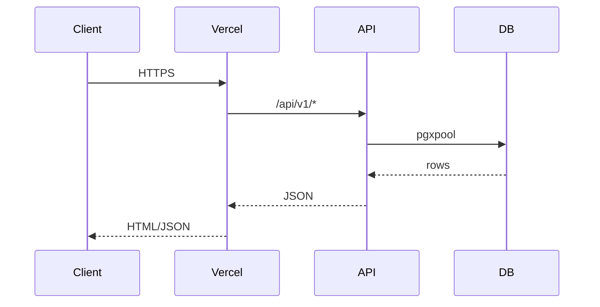
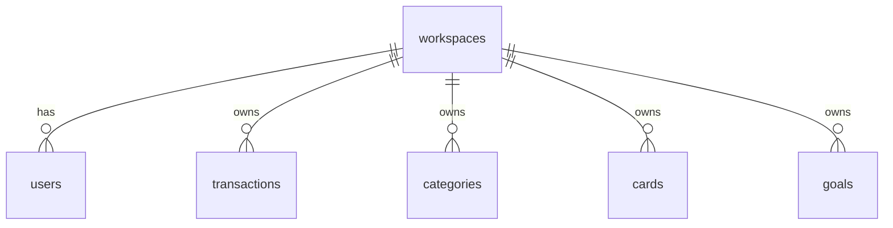
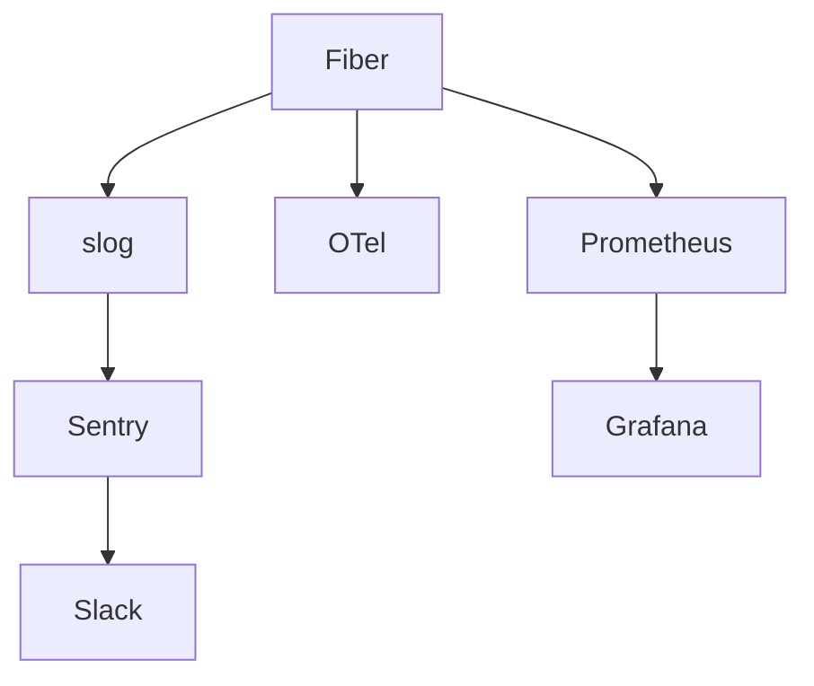
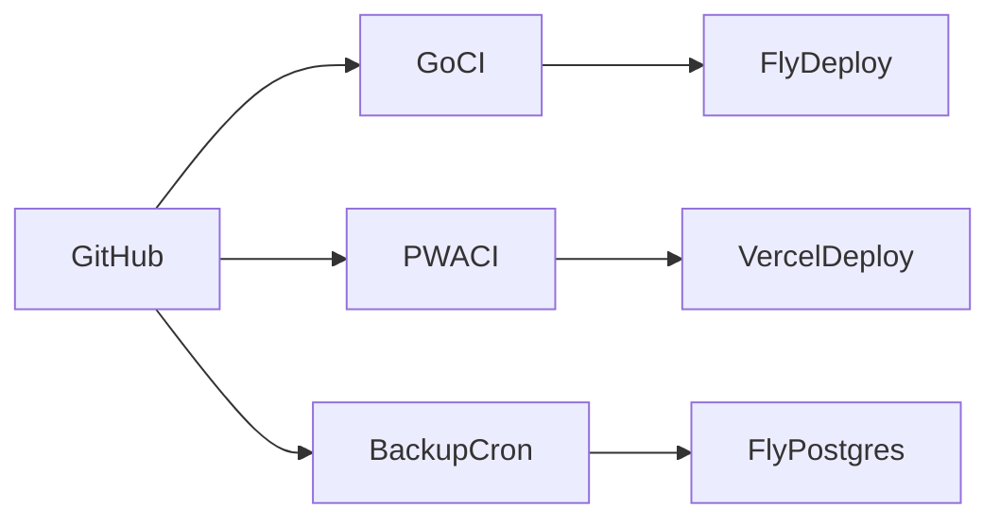
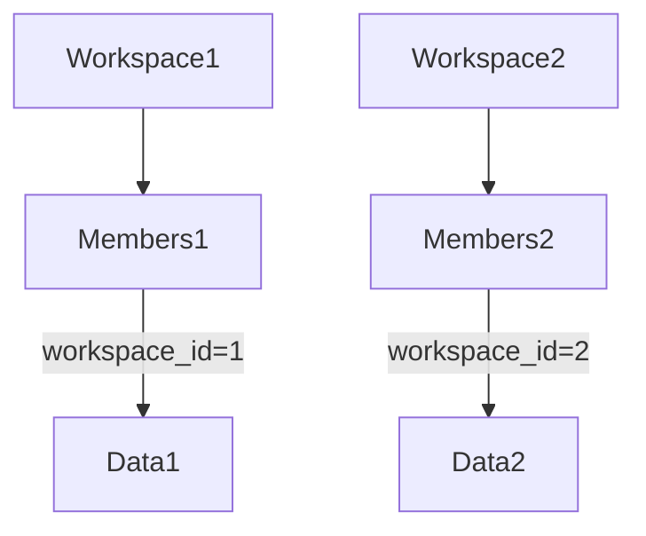

# Arquitetura — Laura Finance

> Documento PT-BR. Última revisão: 2026-04-15 (Fase 12).

## 1. Visão geral

Laura Finance é um SaaS fintech multi-tenant com backend Go (Fiber + pgxpool + slog + Sentry + OTel) e frontend Next.js 16 PWA.

## 2. Fluxo de request

> Runbook relacionado: [ops/runbooks/incident-response.md](./ops/runbooks/incident-response.md)

## 3. Persistência

> Runbook relacionado: [ops/runbooks/migrations.md](./ops/runbooks/migrations.md)

## 4. Observability stack

> Runbook relacionado: [ops/runbooks/sentry-alerts.md](./ops/runbooks/sentry-alerts.md)

## 5. Deploy pipeline

> Runbook relacionado: [ops/runbooks/rollback.md](./ops/runbooks/rollback.md)

## 6. Multi-tenant model

> Runbook relacionado: [ops/runbooks/workspace-isolation.md](./ops/runbooks/workspace-isolation.md)
