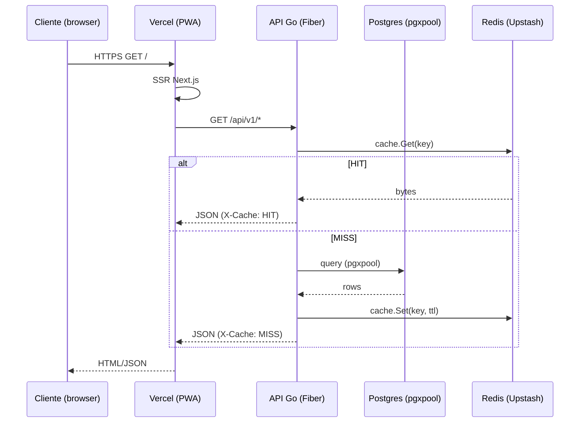

# Fase 12 — Refactoring + Performance + Dívida Técnica (Spec v3 — FINAL)

> Versão: v3 (FINAL — pós Review #2)
> Data: 2026-04-15
> Autor: arquiteto sênior (review final)
> Status: CANÔNICA — substitui v1 e v2; base para plan v1
> Baseline: v2 (2026-04-15)

---

## 0. Mudanças vs v2 (itens chave)

1. **SESSION_HMAC_KEY em test env** — chave fixa em `.env.test` (32 bytes base64 determinísticos), nunca secret de prod; adicionado `.env.test.example` (§13.1).
2. **singleflight global** via `golang.org/x/sync/singleflight.Group` no pacote `cache` — uma instância por processo, com pseudocódigo canônico (§13.2, §12.2 atualizado).
3. **Flag `LLM_LEGACY_NOCONTEXT`** — TTL de remoção **30 dias após deploy estável**, revisão programada na Fase 13 (§13.3).
4. **`architecture.md` em PT-BR** — consistente com `docs/runbooks/*` e `docs/ops/*` (§13.4).
5. **Cache-strategy esclarecida** — TTL é **estratégia única** nesta fase; 1800s para categorias é apenas o TTL mais longo do conjunto, não mudança de estratégia (§13.5).
6. **Pool tuning single-machine** — valores da Fase 12 assumem **1 instância** (cron in-process). Multi-instance + pool sharing fica Fase 13+ junto com event-driven cache (§13.6, §12.4 atualizado).
7. **Volume pgvector em `docker-compose.ci.yml`** — nomeado `pgdata`, com cleanup obrigatório via `docker compose down -v` entre runs (§13.7).
8. **Agrupamento gosec G104** — reagrupado por **arquivo** (3–4 commits, não 13). Lista exata em §13.8 e §12.7 atualizado (verificar via `gosec ./... 2>&1 | grep G104` localmente antes).
9. **Cross-link architecture ↔ runbooks** — cada diagrama mermaid em `architecture.md` menciona a seção de runbook relevante (§13.9, §12.8 atualizado).
10. **Ordem TDD da decomposição `main.go`** — sequência determinística: `db.go` → `logger.go` → `sentry.go` → `otel.go` → `metrics.go` → `health/handler.go`, um commit por extração (§13.10, §12.1 atualizado).
11. **Interface `Cache` + duas implementações** — `RedisCache` e `InMemoryCache` com contrato formal (§13.11).
12. **Pool tuning testing** — bench local com `pgxpool.NewWithConfig` + Postgres 16 + pgvector antes de promover valores (§13.12).
13. **Fixture HMAC — diff canônico** com código exato do helper `authHeader`/`SignedSession` (§13.13).
14. **Mermaid #1 completo** — sequence diagram canônico inline; outros 4 definidos como stubs com seções (§13.14, §12.8 atualizado).
15. **Coverage instrumentation** — arquivo único `laura-go/test/testmain.go` com `TestMain` e testcontainer pgvector compartilhado (§13.15).

---

## 1. Objetivo

Eliminar dívida técnica acumulada nas fases 1–11 do Laura Finance, reorganizar o backend Go em módulos coesos, zerar warnings de lint em código novo no PWA, introduzir camada de cache Redis (Upstash) para endpoints quentes, consolidar migrations e publicar documentação de arquitetura — sem depender das credenciais externas bloqueadas (STANDBYs das fases 10–11, exceto `[REDIS-INSTANCE]`).

Metas quantitativas (inalteradas vs v2):

- `laura-go/main.go` < 100 linhas.
- PWA `npm run lint` em `src/lib/actions/*` novos: **0 errors, 0 warnings** (`--max-warnings=0`).
- PWA global: errors 0; warnings podem persistir (backlog controlado).
- Coverage Go `internal/` > **30%** (Fase 13 eleva a 50%).
- Cache-hit ratio em `/dashboard`, `/score/snapshot`, `/reports/*` > **80%** pós warm-up.
- E2E Playwright full-suite em CI < 10min.
- `docs/architecture.md` (PT-BR) publicado com 5 diagramas mermaid + cross-link runbooks.

## 2. Contexto e motivação

Ver v1 §2 — válido integralmente.

## 3. Escopo

### 3.1. Dentro do escopo (22 itens)

Ver v1 §3.1 — 7 blocos, 22 itens.

### 3.2. Fora do escopo

- i18n (Fase 13).
- Open Finance real (Fase 14+).
- PWA RUM Sentry (Fase 13).
- Promoção `no-explicit-any` a `error` global (Fase 13 após zerar backlog).
- Event-driven cache invalidation cross-instance (Fase 13 via pub/sub).
- Sentry IaC via Terraform (Fase 13+).
- Coverage > 30% (Fase 13 visa 50%).
- **Multi-instance pool sharing** (Fase 13+ junto com event-driven cache).

## 4. Pendências detalhadas agrupadas

Conteúdo da v1 §4.1–§4.7 válido com os mesmos ajustes da v2 + refinamentos trazidos no §13 deste documento. Veja §12 para detalhes técnicos.

### 4.3. (cache + performance)

Item 12 — Upstash managed em prod. Fallback in-memory LRU quando:
- `REDIS_URL` ausente/vazio.
- `cache.Redis.Ping()` falha por mais de 5s em boot.
- `CACHE_DISABLED=true` (kill-switch).

Item 11 — TTLs canônicos em §12.3; estratégia única = **TTL**. Event-driven cache apenas Fase 13.

Item 13 — Pool tuning para **1 instância single-machine** (§12.4); testing via bench local §13.12.

## 5. Decisões de arquitetura

5 decisões da v1, reforçadas por §11 (v2) e §13 (v3).

## 6. Pré-requisitos / dependências externas (STANDBY)

- **`[REDIS-INSTANCE]`** — URL Upstash (formato `rediss://default:<token>@<host>:6379`). **Único STANDBY** da Fase 12. Solicitar ao usuário antes da subfase 4.3. Subfases 4.1/4.2/4.4/4.5/4.6/4.7 independem (fallback in-memory LRU cobre dev/CI).

## 7. Critérios de aceite (DoD)

Ver v1 §7 + 3 adicionais da v2 (CACHE_DISABLED, REDIS_URL vazio, mermaid ×5). Adicional v3:

- [ ] `go test -tags=integration -coverpkg=./internal/... ./...` gera coverage consolidado via `test/testmain.go` compartilhado.
- [ ] `architecture.md` em PT-BR com 5 diagramas cross-linkando runbooks específicos.
- [ ] gosec G104 zerado em `internal/admin/*` (verificar `gosec ./... 2>&1 | grep -c G104` == 0).

## 8. Riscos

Tabela da v2 válida + nenhum risco novo (pool tuning reclassificado como single-machine remove R4 como risco de over-provisioning multi-instância).

## 9. Métricas de sucesso

Ver v1 §9 + adição v2. Sem alterações v3.

## 10. Plano de testes

v1 §10 + §12.5 (testcontainers) + §13.15 (testmain compartilhado).

---

## 11. Resolução de questões abertas v1 → decisão final

Mantida da v2 (10 itens). Ver v2 §11.

## 12. Detalhes técnicos (atualizados)

### 12.1. Decomposição de `main.go` — ordem TDD

Sequência determinística (dependências crescentes). Cada extração = 1 commit + 1 teste mínimo.

| Ordem | Arquivo | Commit message | Dependências |
|-------|---------|----------------|--------------|
| 1 | `internal/bootstrap/db.go` | `refactor(bootstrap): extrai InitDB de main.go` | nenhuma |
| 2 | `internal/bootstrap/logger.go` | `refactor(bootstrap): extrai InitLogger` | nenhuma |
| 3 | `internal/bootstrap/sentry.go` | `refactor(bootstrap): extrai InitSentry` | logger |
| 4 | `internal/bootstrap/otel.go` | `refactor(bootstrap): extrai InitOTel` | logger |
| 5 | `internal/bootstrap/metrics.go` | `refactor(bootstrap): extrai InitMetrics` | logger |
| 6 | `internal/health/handler.go` | `refactor(health): move /health e /ready` | db + whatsapp + llm + redis |

`bootstrap.go` orquestra as 5 funções. `main.go` ≤ 60 linhas ao fim.

### 12.2. Cache helper `GetOrCompute` — singleflight global

```go
// laura-go/internal/cache/cache.go
package cache

import (
    "context"
    "encoding/json"
    "log/slog"
    "os"
    "time"

    "golang.org/x/sync/singleflight"
)

// sg é singleflight GLOBAL do processo (uma instância).
// Evita thundering herd cross-request.
var sg singleflight.Group

type Cache interface {
    Get(ctx context.Context, key string) ([]byte, bool, error)
    Set(ctx context.Context, key string, val []byte, ttl time.Duration) error
    Invalidate(ctx context.Context, pattern string) error
}

func GetOrCompute[T any](
    ctx context.Context,
    c Cache,
    key string,
    ttl time.Duration,
    compute func(context.Context) (T, error),
) (T, bool /*hit*/, error) {
    var zero T
    if os.Getenv("CACHE_DISABLED") == "true" {
        v, err := compute(ctx)
        return v, false, err
    }
    if raw, ok, err := c.Get(ctx, key); err == nil && ok {
        var out T
        if jsonErr := json.Unmarshal(raw, &out); jsonErr == nil {
            return out, true, nil
        }
        slog.WarnContext(ctx, "cache unmarshal failed", "key", key)
    }
    v, err, _ := sg.Do(key, func() (any, error) {
        return compute(ctx)
    })
    if err != nil {
        return zero, false, err
    }
    typed := v.(T)
    if raw, mErr := json.Marshal(typed); mErr == nil {
        _ = c.Set(ctx, key, raw, ttl)
    }
    return typed, false, nil
}
```

Handlers expõem `X-Cache: HIT|MISS|DISABLED`.

### 12.3. TTLs canônicos por domínio

| Endpoint | Key pattern | TTL | Racional |
|----------|-------------|-----|----------|
| `/api/v1/dashboard` | `ws:{id}:dashboard:{paramsHash}:{YYYYMM}` | 60s | Mês corrente volátil. |
| `/api/v1/score/snapshot` | `ws:{id}:score:{userId}` | 300s | Score async-recalc. |
| `/api/v1/reports/monthly` | `ws:{id}:reports:monthly:{YYYYMM}` | 600s | Mês fechado ≈ imutável. |
| `/api/v1/reports/categorical` | `ws:{id}:reports:cat:{paramsHash}` | 600s | Idem. |
| `/api/v1/reports/cashflow` | `ws:{id}:reports:cash:{paramsHash}` | 600s | Idem. |
| `/api/v1/categories` | `ws:{id}:categories:v1` | 1800s | Raramente muda; ainda TTL-only nesta fase. |

**Nota v3:** estratégia única = TTL. 1800s em categorias **não** é event-driven — apenas o TTL mais longo do conjunto. Fase 13 introduz invalidação event-driven via pub/sub.

### 12.4. pgxpool tuning — single-machine Fly small 512MB (Fase 12)

App roda **1 instância** na Fase 12 (cron in-process). Valores:

```env
PG_MAX_CONNS=10
PG_MIN_CONNS=2
PG_MAX_CONN_LIFETIME=30m
PG_MAX_CONN_IDLE_TIME=5m
PG_HEALTH_CHECK_PERIOD=1m
```

Racional: 10 conns × 1 réplica = 10, deixa margem de ~10 conns para migrations/admin/psql no Postgres 512MB (~20 conns máx). Multi-instance fica Fase 13+.

### 12.5. Testcontainers-go setup compartilhado

Ver §13.15 (arquivo `laura-go/test/testmain.go`).

### 12.6. Fixture HMAC — diff canônico

Ver §13.13.

### 12.7. gosec G104 — agrupamento por arquivo

**Reagrupado em 3–4 commits (não 13)**, 1 por arquivo `admin_*.go`. Lista preliminar (verificar exato via `gosec ./... 2>&1 | grep G104` antes da implementação):

| Commit | Arquivo | Ocorrências aproximadas |
|--------|---------|-------------------------|
| 1 | `internal/admin/admin_whatsapp.go` | ~3 |
| 2 | `internal/admin/admin_categories.go` | ~3–5 |
| 3 | `internal/admin/admin_users.go` | ~2–3 |
| 4 | `internal/admin/admin_stats.go` | resto |

Commit message padrão: `fix(admin): trata erros ignorados em <arquivo> (gosec G104)`.

Padrão de remediação idêntico ao v2:

```go
if err := mgr.CreateInstance(ctx, id); err != nil {
    slog.ErrorContext(ctx, "create instance failed", "err", err, "instance_id", id)
    return fiber.NewError(fiber.StatusInternalServerError, "create failed")
}
```

### 12.8. `docs/architecture.md` — 5 diagramas mermaid + cross-link runbooks

Todos em PT-BR. Cada diagrama referencia seção(ões) de runbook.

| # | Diagrama | Tipo | Cross-link runbook |
|---|----------|------|--------------------|
| 1 | Fluxo de request | sequenceDiagram | `runbooks/incident-response.md` |
| 2 | Persistência (ER) | erDiagram | `runbooks/migrations.md` |
| 3 | Observability stack | flowchart TB | `runbooks/sentry-alerts.md` |
| 4 | Deploy pipeline | flowchart LR | `runbooks/rollback.md` |
| 5 | Multi-tenant model | flowchart TB | `runbooks/workspace-isolation.md` |

Diagrama #1 canônico em §13.14. Outros 4 como stubs com seções definidas; conteúdo final na implementação.

### 12.9. Kill-switch cache

Sem alterações vs v2. Env `CACHE_DISABLED=true`, TTL manual 24h, log amostrado 1:1000.

---

## 13. Resolução do review #2 — 15 itens

### 13.1. SESSION_HMAC_KEY em test env

- **Decisão:** chave fixa determinística (32 bytes base64) em `.env.test` commitada. Não é secret — vale apenas para test env local/CI.
- **Geração única:** `openssl rand -base64 32 > /tmp/k && cat /tmp/k` — valor fixado.
- **Arquivos:**
  - `.env.test` (commitado, valor real de teste).
  - `.env.test.example` (commitado, documenta formato).
- **Nunca reutilizar** o valor de `.env.production`.

### 13.2. singleflight global

Pacote `cache` expõe `var sg singleflight.Group` no topo — **1 instância por processo**. Sem per-instance para simplicidade e evitar cross-talk em test paralelos (cada test usa key prefix único `test:<uuid>:...`).

Dependência: `golang.org/x/sync/singleflight` (já indireta via Fiber). Fixar em `go.mod`.

### 13.3. TTL de remoção da flag `LLM_LEGACY_NOCONTEXT`

- **TTL:** 30 dias após deploy estável (medido via ausência de Sentry alerts `LLM_LEGACY_NOCONTEXT=true` por 7 dias corridos).
- **Revisão programada:** Fase 13, tarefa dedicada.
- **Ação de remoção:** delete env var no Fly + deletar branch morto no código.
- **Alerta Sentry:** se flag=true em prod após T+30d → pager.

### 13.4. Idioma do `architecture.md`

- **Decisão:** PT-BR.
- Consistência com `docs/runbooks/*`, `docs/ops/*`, specs da metodologia.
- Código dos diagramas (labels mermaid) em inglês apenas quando são termos técnicos universais (`Postgres`, `pgxpool`, `Sentry SDK`).

### 13.5. TTL 1800s vs "só TTL" — contradição esclarecida

Não há contradição. **TTL é estratégia única nesta fase.** 1800s em categorias é apenas um TTL mais longo; não introduz invalidação event-driven. Fase 13 promove para event-driven quando necessário.

### 13.6. Pool tuning em 3+ réplicas

Na Fase 12, app é single-machine (1 instância, cron in-process). Valores §12.4 calibrados para 1 instância. Multi-instance + pool-sharing coordenado entram na Fase 13+ (em conjunto com event-driven cache).

### 13.7. Volume pgvector em `docker-compose.ci.yml`

```yaml
services:
  postgres:
    image: pgvector/pgvector:pg16
    volumes:
      - pgdata:/var/lib/postgresql/data
volumes:
  pgdata:
```

**Cleanup obrigatório entre CI runs:**
```yaml
- name: Cleanup volumes
  if: always()
  run: docker compose -f docker-compose.ci.yml down -v
```

### 13.8. Agrupamento 13 commits G104

Ver §12.7 atualizado. Reduzido de 13 para 3–4 commits por arquivo. Lista preliminar — validar exato via `gosec ./... 2>&1 | grep G104` antes de iniciar.

### 13.9. Cross-link `architecture.md` ↔ runbooks

Cada seção de diagrama em `architecture.md` termina com:
```md
> Runbook relacionado: [runbooks/<nome>.md](./runbooks/<nome>.md)
```

Cada runbook em `docs/runbooks/*.md` começa com:
```md
> Arquitetura: seção [#<slug>](../architecture.md#<slug>)
```

### 13.10. Refactoring main.go — ordem TDD

Ver §12.1 atualizado. Sequência: `db → logger → sentry → otel → metrics → health`.

### 13.11. Cache interface + duas implementações

Interface em §12.2. Implementações:

| Arquivo | Struct | Back-end | Uso |
|---------|--------|----------|-----|
| `internal/cache/redis.go` | `RedisCache` | `github.com/redis/go-redis/v9` | prod + dev com `REDIS_URL` |
| `internal/cache/memory.go` | `InMemoryCache` | `github.com/hashicorp/golang-lru/v2` | fallback (CI, boot-sem-redis, `CACHE_DISABLED`) |

Factory em `bootstrap/cache.go`:

```go
func InitCache(cfg Config) Cache {
    if cfg.CacheDisabled || cfg.RedisURL == "" {
        return NewInMemoryCache(1024)
    }
    rc, err := NewRedisCache(cfg.RedisURL)
    if err != nil {
        slog.Warn("redis unreachable, falling back to in-memory LRU", "err", err)
        return NewInMemoryCache(1024)
    }
    return rc
}
```

### 13.12. Pool tuning testing

Bench local:
```sh
cd laura-go
go test -bench=BenchmarkPool -benchmem ./internal/db/...
```

Testcontainer `pgvector/pgvector:pg16` dedicado. Valores §12.4 validados antes de promover.

### 13.13. API E2E auth fixture HMAC — diff canônico

```go
// laura-go/internal/testutil/session.go
package testutil

import (
    "crypto/hmac"
    "crypto/sha256"
    "encoding/hex"
    "fmt"
    "net/http"
    "os"
    "testing"
    "time"
)

func SignedSession(t *testing.T, userID, workspaceID string) *http.Cookie {
    t.Helper()
    secret := []byte(os.Getenv("SESSION_HMAC_KEY"))
    if len(secret) == 0 {
        t.Fatal("SESSION_HMAC_KEY vazio em test env — ver .env.test")
    }
    payload := fmt.Sprintf("%s:%s:%d", userID, workspaceID, time.Now().Unix())
    mac := hmac.New(sha256.New, secret)
    mac.Write([]byte(payload))
    sig := hex.EncodeToString(mac.Sum(nil))
    return &http.Cookie{Name: "laura_session", Value: payload + "." + sig}
}
```

Diff esperado em `api_e2e_test.go`:

```diff
-func authenticatedRequest(t *testing.T, method, path string, body io.Reader) *http.Request {
-    req := httptest.NewRequest(method, path, body)
-    req.Header.Set("Authorization", "Bearer "+legacyJWT(t))
-    return req
-}
+func authenticatedRequest(t *testing.T, method, path string, body io.Reader) *http.Request {
+    req := httptest.NewRequest(method, path, body)
+    req.AddCookie(testutil.SignedSession(t, testUserID, testWorkspaceID))
+    return req
+}
```

Build tag `//go:build e2e` **removida**; suíte passa a correr com `go test -tags=integration ./...`.

### 13.14. architecture.md mermaid #1 — canônico



> Runbook relacionado: [runbooks/incident-response.md](./runbooks/incident-response.md)

Demais diagramas (#2–#5) definidos como stubs com seções em §12.8; conteúdo final na implementação da subfase 4.6.

### 13.15. Coverage instrumentation — `TestMain` compartilhado

```go
// laura-go/test/testmain.go
//go:build integration

package test

import (
    "context"
    "os"
    "testing"
)

func TestMain(m *testing.M) {
    ctx := context.Background()
    PGDSN, _ = startPostgresWithPgvector(ctx)
    RedisURL, _ = startRedis(ctx)
    applyMigrations(PGDSN)
    code := m.Run()
    stopAll(ctx)
    os.Exit(code)
}
```

Exporta `PGDSN` e `RedisURL` como vars públicas de pacote. Suítes downstream importam via `laura-go/test`.

CI:
```sh
go test -tags=integration -coverpkg=./internal/... -coverprofile=coverage.out ./...
go tool cover -func=coverage.out | grep total
```

---

## 14. Comandos canônicos

### 14.1. Lint + estático

```sh
cd laura-go
go vet ./...
gosec -quiet ./...
staticcheck ./...
gosec ./... 2>&1 | grep G104 | wc -l   # deve ser 0 após §12.7
```

### 14.2. Testes + coverage

```sh
cd laura-go
go test ./...                                                   # unit
go test -tags=integration -coverpkg=./internal/... \
  -coverprofile=coverage.out ./...                              # integration + cover
go tool cover -func=coverage.out | grep total                   # conferir >30%
```

### 14.3. PWA lint gate

```sh
cd apps/web
npm run lint                                                           # global (warnings OK)
npx eslint src/lib/actions src/lib/services src/types --max-warnings=0 # gate novo
```

### 14.4. Redis local + debug

```sh
docker compose up -d redis
redis-cli -u "$REDIS_URL" KEYS 'ws:*' | head
redis-cli -u "$REDIS_URL" TTL 'ws:abc:dashboard:...'
fly secrets set CACHE_DISABLED=true --app laura-finance-api    # kill-switch prod
fly secrets unset CACHE_DISABLED --app laura-finance-api       # remover em ≤24h
```

### 14.5. docker-compose CI

```sh
docker compose -f docker-compose.ci.yml up -d
docker compose -f docker-compose.ci.yml ps
docker compose -f docker-compose.ci.yml logs postgres
docker compose -f docker-compose.ci.yml down -v                # cleanup volumes
```

### 14.6. Playwright full

```sh
cd apps/web
npx playwright install --with-deps chromium
npx playwright test
npx playwright show-report
```

### 14.7. Bench pool tuning

```sh
cd laura-go
go test -bench=BenchmarkPool -benchmem ./internal/db/...
```

### 14.8. Migrations (go:embed)

```sh
cd laura-go
go build ./...                        # confirma embed OK
go run ./cmd/migrate up               # aplica via embed FS
```

---

## 15. Checklist consolidado de entregas

### Refactoring (6)
- [ ] `internal/bootstrap/db.go` + teste.
- [ ] `internal/bootstrap/logger.go` + teste.
- [ ] `internal/bootstrap/sentry.go` + teste.
- [ ] `internal/bootstrap/otel.go` + teste.
- [ ] `internal/bootstrap/metrics.go` + teste.
- [ ] `internal/health/handler.go` + teste (liveness + readiness com whatsmeow/llm/db/redis reais).

### Lint + Tests (7)
- [ ] `api_e2e_test.go` migrado para HMAC cookie fixture + build tag `e2e` removida.
- [ ] gosec G104 zerado em `internal/admin/*` (3–4 commits por arquivo).
- [ ] 87 `no-explicit-any` zerados em `src/lib/actions/*` + `services/*` + `types/*`.
- [ ] ESLint override error-in-new-dirs + gate CI `--max-warnings=0`.
- [ ] 6 `react-hooks` + 8 `react/no-unescaped-entities` resolvidos.
- [ ] `test/testmain.go` com testcontainers compartilhado.
- [ ] Coverage Go > 30%.

### Cache (6)
- [ ] `internal/cache/cache.go` (interface + `GetOrCompute[T]` + singleflight global).
- [ ] `internal/cache/redis.go` (`RedisCache`).
- [ ] `internal/cache/memory.go` (`InMemoryCache` LRU fallback).
- [ ] `bootstrap/cache.go` factory com fallback automático.
- [ ] Integração nos handlers `/dashboard`, `/score/snapshot`, `/reports/*`, `/categories` com TTLs §12.3.
- [ ] Kill-switch `CACHE_DISABLED` + header `X-Cache: HIT|MISS|DISABLED`.

### Infra (5)
- [ ] Migrations consolidadas em `laura-go/internal/migrations/` via `go:embed`; `infrastructure/migrations/` deletado; Dockerfile limpo.
- [ ] `docker-compose.ci.yml` com postgres+pgvector+redis + volume `pgdata` + cleanup `down -v`.
- [ ] `.env.test` + `.env.test.example` com `SESSION_HMAC_KEY` determinística.
- [ ] pgx pool tuning §12.4 via env vars + bench local validado.
- [ ] `BUILD_SHA`/`BUILD_TIME` validados em Vercel + Fly.

### Observability (4)
- [ ] Métricas `workspace_id` em `/api/v1/reports/*`.
- [ ] Sentry scope `tenant_id` em 100% dos eventos.
- [ ] 3 regras Sentry com rate-limit 1/30min + `environment:production`.
- [ ] Flag `LLM_LEGACY_NOCONTEXT` com TTL 30 dias + alerta se true em prod.

### DX (4)
- [ ] Playwright full em CI via `docker-compose.ci.yml` < 10min.
- [ ] Ctx propagado em `ChatCompletion(ctx, ...)` — big-bang.
- [ ] Whatsmeow check real no `/ready`.
- [ ] LLM Ping real (completion curta + timeout 3s).

### Docs + Cleanup (5)
- [ ] `docs/architecture.md` (PT-BR) com 5 diagramas mermaid + cross-link runbooks.
- [ ] `docs/runbooks/whatsmeow.md` (rescan QR pós-restart Fly).
- [ ] `docs/runbooks/sentry-alerts.md`.
- [ ] `package-lock.json` resolvido e commitado.
- [ ] Tag git `phase-12-complete`.

**Total: 37 itens.**

---

## Self-review v3 — questões abertas para review #3

1. **[REDIS-INSTANCE]** — único STANDBY restante. Solicitar URL Upstash antes da subfase 4.3.

---
